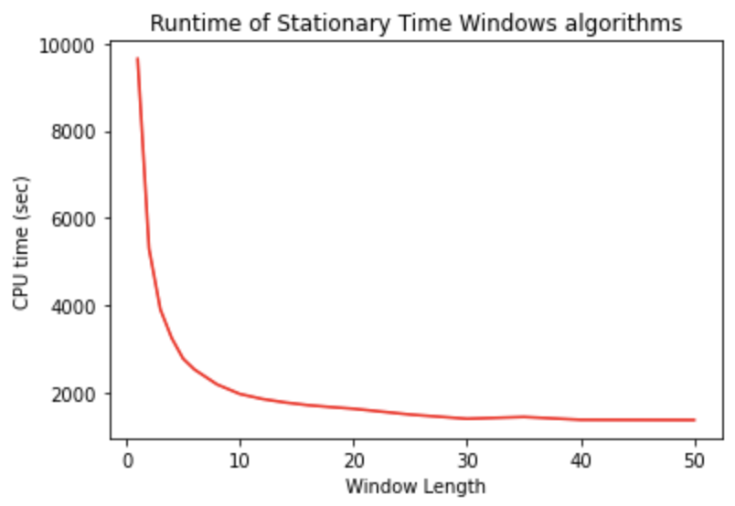

# WindowSHAP
## Introduction
 
When working with time-series predictive models, it's crucial to have an explainability method that is suitable for time-series data, computationally efficient, and capable of handling dependencies between sequential data points. WindowSHAP is a framework specifically designed for this purpose.This repository includes the implementation of WindowSHAP framework, an effective explanation method for time-series classifiers. For more information about the method, please refer to the [original paper](https://arxiv.org/abs/2211.06507).

WindowSHAP enhances the explainability of time-series prediction models by reducing the total number of features for which Shapley values must be determined. It does so by combining neighboring time steps into a time window. The framework offers various types of time windows, each with its own advantages. The main contributions of WindowSHAP are:

- Adapting Shapley additive explanations for time-series data in a very efficient way.
- Introducing variations of WindowSHAP based on different windowing techniques, both for fixed- and variable-length time windows.
The following figure shows how increasing the window length in the WindowSHAP framework can reduce the runtime of the algorithm exponentially.

This tutorial demonstrates how to use the WindowSHAP framework, which provides three distinct algorithms: Stationary, Sliding, and Dynamic WindowSHAP. These algorithms help explain time-series classifiers using Shapley values.

## How to Use WindowSHAP
To use the WindowSHAP framework, one just need to include the `windowshap.py` file into their working directory. There are three different algorithms included in the package; Stationary WindowSHAP, Sliding WindowSHAP, and Dynamic WindowSHAP. For each of the afored mentioned algorithms, a class is defined in the `windowshap.py`.
